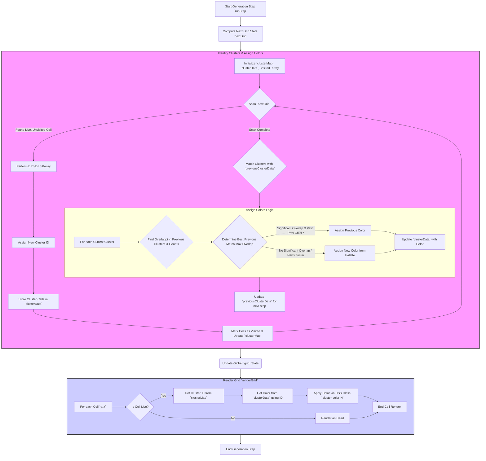

# Plan: Cluster Coloring for Game of Life (Tron Style)

## Objective

Enhance the Game of Life visualization to assign distinct colors to different connected clusters of live cells (using 8-way connectivity). Aim to maintain color consistency for clusters across generations and handle cluster merges intelligently.

## Core Idea

1.  **Identify Clusters:** In each generation, find all groups of connected live cells (clusters) using 8-way connectivity (horizontally, vertically, and diagonally adjacent).
2.  **Track Clusters:** Compare the clusters found in the current generation with those from the previous generation to determine which clusters persist, split, merge, or are newly formed.
3.  **Assign Colors:** Assign colors based on this tracking. Persisting clusters keep their color. New colors are assigned from a palette for new clusters. Merged clusters inherit the color of the largest contributing previous cluster.
4.  **Render:** Update the rendering logic to apply the assigned colors to the cells via CSS classes.

## Refined Merge Logic

When two or more clusters from the previous generation merge into a single cluster in the current generation:
1.  Identify all the previous clusters that contributed cells to the new, merged cluster.
2.  Count how many cells each previous cluster contributed.
3.  The new, merged cluster will inherit the color of the previous cluster that contributed the *most* cells (the "dominant color").

## Color Palette (5 Colors)

1.  `#00FFFF` (Cyan - Existing)
2.  `#DAA520` (Goldenrod)
3.  `#DC143C` (Crimson)
4.  `#FFD700` (Gold)
5.  `#ADFF2F` (GreenYellow)

## Data Structures

*   `grid`: The existing 2D array, now storing cell state objects: `{ isAlive: boolean, newlyAlive: boolean }`.
*   `clusterMap`: A 2D array (same dimensions as `grid`). Stores a `clusterId` (number) for each live cell (`isAlive: true`) in the *current* generation, or `null` for dead cells.
*   `clusterData`: An object/map storing info about each cluster in the *current* generation. Keyed by `clusterId`. Stores `{ id: number, cells: Set<string>, color: string | null }`. `cells` uses coordinate strings like `"y,x"`.
*   `previousClusterData`: Stores the `clusterData` from the *previous* generation, used for tracking. Initialized as `{}`.
*   `colorPalette`: An array of the 5 predefined color strings.
*   `nextClusterId`: A counter to generate unique cluster IDs within a generation (starts at 1).
*   `nextColorIndex`: An index to cycle through the `colorPalette`. Initialized as `0`.
*   `visited`: A 2D boolean array (same dimensions as `grid`) used during cluster identification (BFS/DFS) to track visited cells within a single generation step.

## Algorithm Steps



## Detailed Implementation Plan

1.  **Initialization (`initialize`, `handleReset`, `handleClear`):**
    *   Initialize `previousClusterData = {}`.
    *   Initialize `nextColorIndex = 0`.
    *   Define `colorPalette` globally with the 5 specified colors.

2.  **Modify `runStep`:**
    *   Calculate the next grid state: `const nextGrid = computeNextGeneration();` (This now returns objects `{isAlive, newlyAlive}`).
    *   **New Step:** Call `clusterInfo = identifyAndColorClusters(nextGrid, previousClusterData, colorPalette, nextColorIndex)`.
    *   This function returns `{ clusterMap, clusterData, nextColorIndex }`.
    *   Update global state: `grid = nextGrid`, `previousClusterData = clusterInfo.clusterData`, `nextColorIndex = clusterInfo.nextColorIndex`.
    *   Modify the `renderGrid` call: `renderGrid(clusterInfo.clusterMap, clusterInfo.clusterData)`. *(Note: `renderGrid` itself now reads the global `grid`)*.

3.  **Implement `identifyAndColorClusters(currentGrid, prevData, palette, initialColorIndex)`:**
    *   Initialize `clusterMap` (filled with `null`), `currentClusterData = {}`, `visited` array (filled with `false`), `nextClusterId = 1`.
    *   **Cluster Identification (BFS/DFS):**
        *   Iterate through `currentGrid`. If `currentGrid[y][x]?.isAlive === true` and `!visited[y][x]`:
            *   Perform BFS or DFS (8-way connectivity) starting from `(y, x)`.
            *   Collect all connected live cell coordinates in a `Set<string>` (`cellSet`).
            *   Mark these cells as `visited[ny][nx] = true`.
            *   Assign `clusterMap[ny][nx] = nextClusterId` for all cells in `cellSet`.
            *   Store: `currentClusterData[nextClusterId] = { id: nextClusterId, cells: cellSet, color: null }`.
            *   Increment `nextClusterId`.
    *   **Cluster Matching & Coloring:**
        *   Let `currentColorIndex = initialColorIndex`.
        *   Create `prevCellToClusterId` map from `prevData` (map `"y,x"` string to previous cluster ID and color).
        *   For each `clusterId` in `currentClusterData`:
            *   Calculate overlaps: Iterate through `cells` in `currentClusterData[clusterId]`. For each cell `"y,x"`, check if it exists in `prevCellToClusterId`. Tally the counts for each `prevClusterId` found (`overlapCounts = { prevId1: count1, prevId2: count2, ... }`).
            *   Find `bestPrevId` with the maximum overlap count (`maxOverlapCount`).
            *   Determine significance (e.g., `maxOverlapCount / currentClusterData[clusterId].cells.size > 0.4` AND `maxOverlapCount / prevData[bestPrevId].cells.size > 0.4`). Handle cases where `prevData[bestPrevId]` might not exist.
            *   If significant overlap with `bestPrevId` exists and `prevData[bestPrevId].color` is valid:
                *   Assign `currentClusterData[clusterId].color = prevData[bestPrevId].color`.
            *   Else (new cluster, insignificant overlap, or split):
                *   Assign `currentClusterData[clusterId].color = palette[currentColorIndex % palette.length]`.
                *   Increment `currentColorIndex`.
    *   Return `{ clusterMap, clusterData: currentClusterData, nextColorIndex: currentColorIndex }`.


4.  **Modify `renderGrid(clusterMap, currentClusterData)`:** *(Note: Accessing global `grid`)*
    *   Accept `clusterMap` and `currentClusterData` as parameters (or access globally if preferred).
    *   Inside the cell rendering loop (`y`, `x`):
        *   Remove any existing `cluster-color-*` classes from the cell first.
        *   Get the current cell state: `const cellState = grid[y]?.[x];`
        *   If `cellState?.isAlive === true`:
            *   Get `clusterId = clusterMap[y][x]`.
            *   If `clusterId` and `currentClusterData[clusterId]` exist:
                *   Get `color = currentClusterData[clusterId].color`.
                *   Find `colorIndex = colorPalette.indexOf(color)`.
                *   If `colorIndex !== -1`, add class `cluster-color-${colorIndex}`.
            *   Add `live` class.
            *   *(The `newly-alive` class is handled automatically by the refactored `renderGrid` based on `cellState.newlyAlive`)*
        *   Else (`cellState?.isAlive === false` or `cellState` is null/undefined):
            *   Add `dead` class.
5.  **Add CSS (`style.css`):**
    *   Define rules for `.cell.live.cluster-color-0`, `.cell.live.cluster-color-1`, ..., `.cell.live.cluster-color-4` using the specified palette colors for `background-color`.
    *   Ensure the `.cell.newly-alive` style provides sufficient contrast (e.g., using `border` or `box-shadow` as the background will be overridden by the cluster color). Example:
        ```css
        .cell.live.cluster-color-0 { background-color: #00FFFF; } /* Cyan */
        .cell.live.cluster-color-1 { background-color: #DAA520; } /* Goldenrod */
        .cell.live.cluster-color-2 { background-color: #DC143C; } /* Crimson */
        .cell.live.cluster-color-3 { background-color: #FFD700; } /* Gold */
        .cell.live.cluster-color-4 { background-color: #ADFF2F; } /* GreenYellow */

        /* Adjust newly-alive to be visible over cluster colors */
        .cell.live.newly-alive {
          /* Keep existing bright flash if desired, or use border/outline */
          /* background-color: #ffffff; /* Might be overridden */
          outline: 2px solid white;
          outline-offset: -2px;
          box-shadow: 0 0 5px white; /* Add extra glow */
        }
        ```

6.  **Handle Resizing (`handleSizeChange`):**
    *   Reset cluster tracking on resize: `previousClusterData = {}; nextColorIndex = 0;`. This avoids complex coordinate mapping.